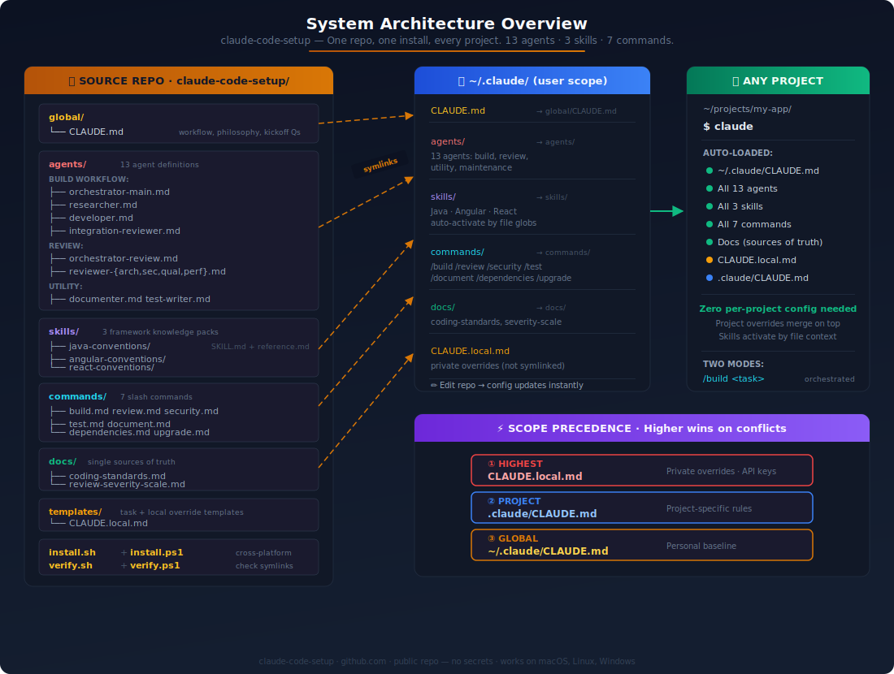
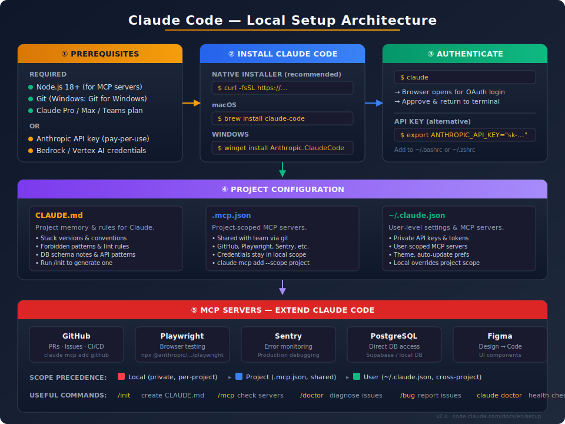
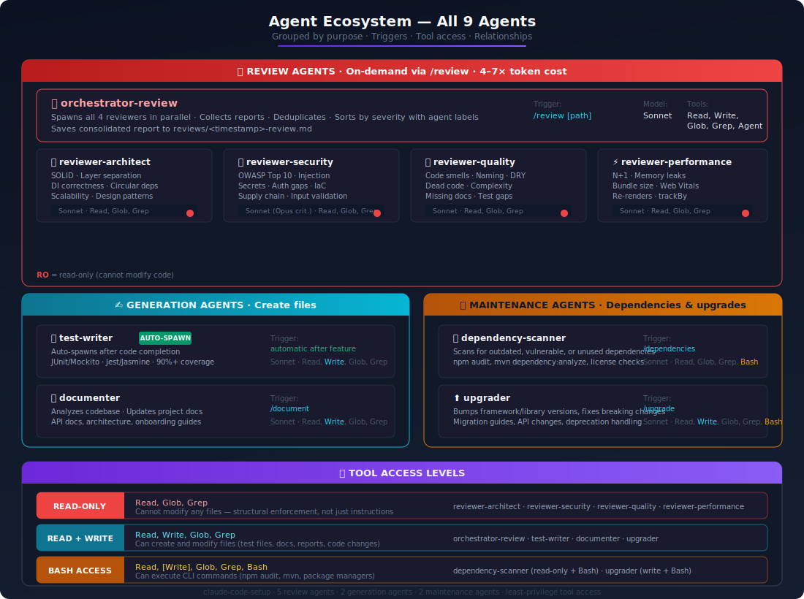
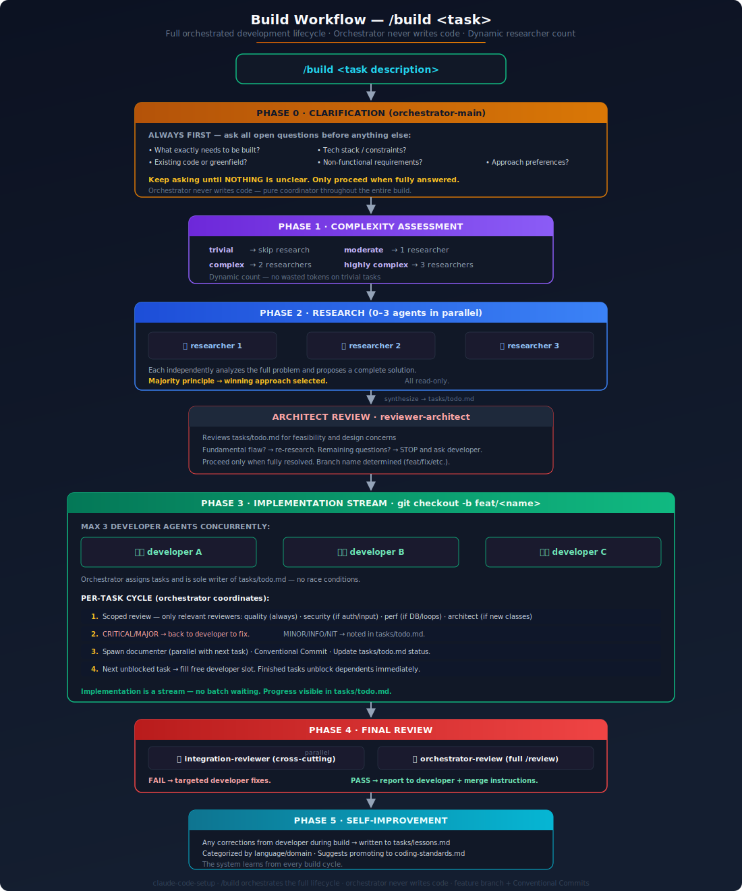
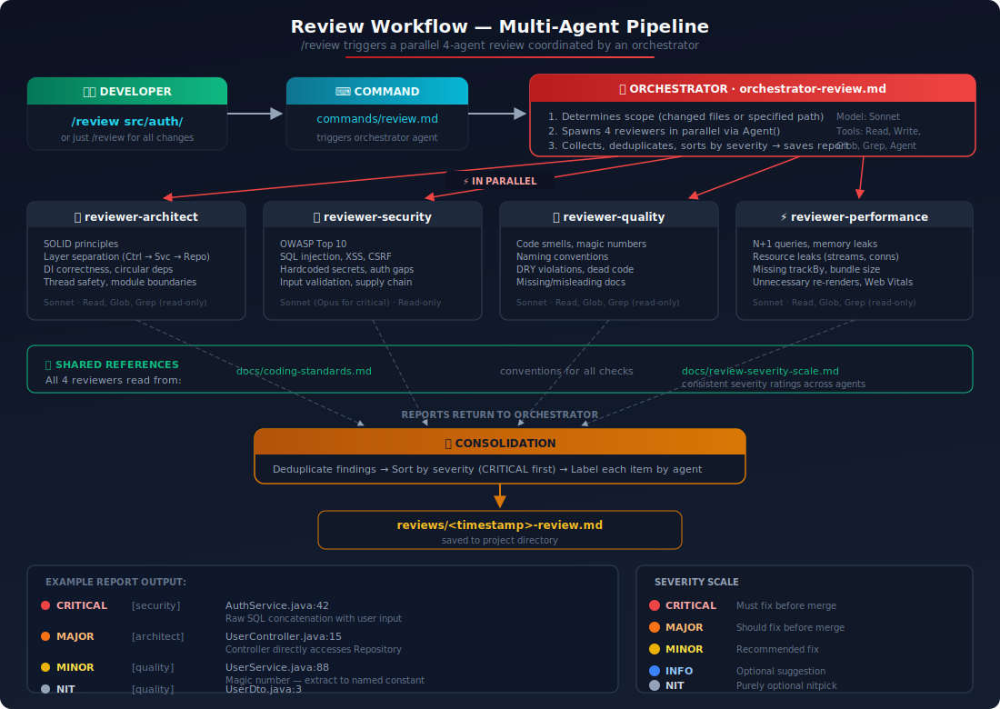
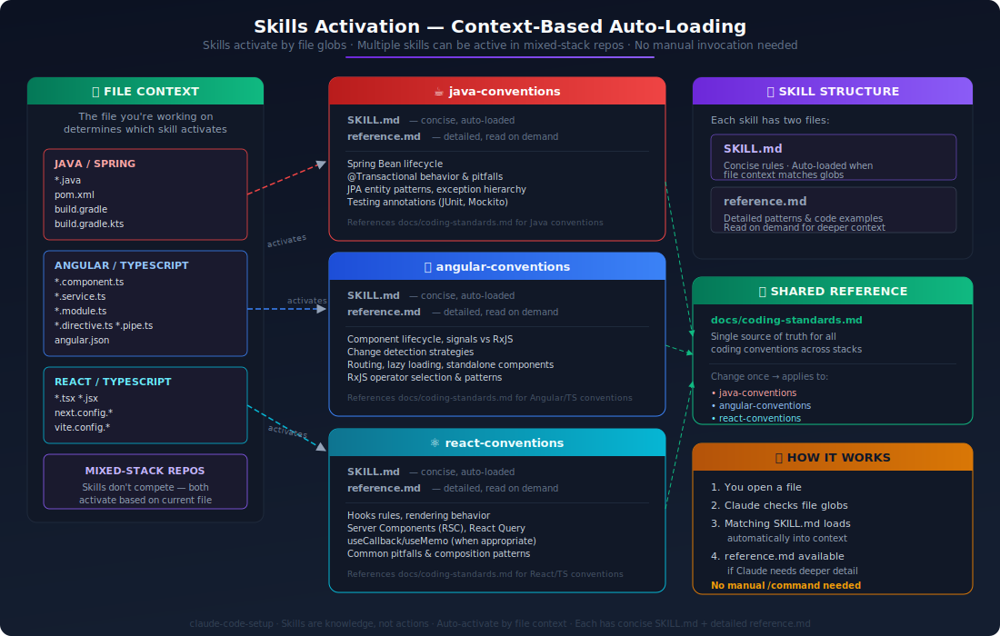
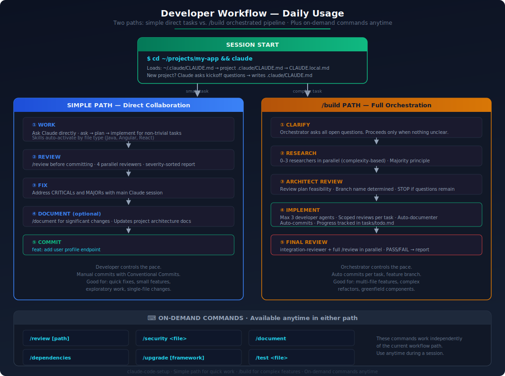

# claude-code-setup

A project-independent, global Claude Code configuration that provides a persistent, personalized AI development environment across all projects. One repo, one install script, works everywhere via symlinks into `~/.claude/`.



## Setup Guide



### Step 1 — Clone this repo somewhere permanent

Pick a location where the repo will stay (it's referenced via symlinks, so don't move it after install).

```bash
# WSL / Linux / macOS
cd ~
git clone https://github.com/YOUR_USER/claude-code-setup.git

# Windows (PowerShell)
cd $env:USERPROFILE
git clone https://github.com/YOUR_USER/claude-code-setup.git
```

### Step 2 — Run the install script

This creates symlinks from the repo into `~/.claude/`. If you already have files in `~/.claude/`, they are backed up automatically before being replaced.

```bash
# WSL / Linux / macOS
cd ~/claude-code-setup
chmod +x install.sh verify.sh
./install.sh

# Windows (PowerShell as Administrator — needed for symlinks)
cd ~\claude-code-setup
.\install.ps1
```

### Step 3 — Verify everything is linked

```bash
./verify.sh        # Unix/WSL
.\verify.ps1       # Windows
```

You should see all green checkmarks. If anything is broken, just re-run the install script.

### Step 4 — (Optional) Edit your private overrides

The install script creates `~/.claude/CLAUDE.local.md` from a template. Open it and add any private settings (API keys, internal paths, company conventions). This file is never committed.

### Step 5 — Use it

That's it. Open any project and start Claude:

```bash
cd ~/projects/my-app
claude
```

Everything loads automatically. No per-project setup needed.

### For new projects

When you start a fresh project, Claude will ask you kickoff questions (purpose, stack, scale, etc.) and write the answers into the project's `.claude/CLAUDE.md`. This gives all agents project-specific context from day one.

### For existing projects

Run `/document` to generate architecture documentation. Claude analyzes the codebase and writes a project-level `.claude/CLAUDE.md` for future sessions.

---

## What You Get

### Commands

| Command | What It Does |
|---------|-------------|
| `/build <task>` | Full orchestrated workflow — research, parallel implementation, review, document, commit |
| `/review` | Code review — up to 4 agents in parallel, severity-sorted report saved to `reviews/` |
| `/review src/auth/` | Scoped review of a specific path |
| `/security AuthService.java` | Quick security-focused review |
| `/test UserService.java` | Generate unit tests for existing code |
| `/document` | Generate or update project architecture documentation |
| `/dependencies` | Scan for vulnerabilities, unused packages, and dependency problems |
| `/upgrade` | Upgrade dependencies and handle breaking changes |

### Agents



**Build Workflow Agents**

| Agent | Role | Access |
|-------|------|--------|
| `orchestrator-main` | Plans, delegates, coordinates — never writes code | Read, Write, Glob, Grep, Agent |
| `researcher` | Analyzes problem and proposes full solution (3 spawned in parallel) | Read-only |
| `developer` | Implements one task + writes tests | Read, Write, Glob, Grep, Bash |
| `integration-reviewer` | Post-build cross-cutting validation | Read-only + Bash |

**Review Agents**

| Agent | Focus | Access |
|-------|-------|--------|
| `orchestrator-review` | Coordinates all reviewers, saves report | Read, Write, Glob, Grep, Agent |
| `reviewer-architect` | SOLID, layering, scalability, design | Read-only |
| `reviewer-security` | OWASP, secrets, auth, supply chain, IaC | Read-only |
| `reviewer-quality` | Code smells, naming, DRY, complexity | Read-only |
| `reviewer-performance` | N+1, leaks, bundle size, Web Vitals | Read-only |

**Utility Agents**

| Agent | Trigger | Access |
|-------|---------|--------|
| `documenter` | Auto after each task completes, or `/document` | Read, Write, Glob, Grep |
| `test-writer` | `/test` — manual, for existing code | Read, Write, Glob, Grep |
| `dependency-scanner` | `/dependencies` | Read-only + Bash |
| `upgrader` | `/upgrade` | Read, Write, Glob, Grep, Bash |

### Build Workflow



When you type `/build <task>`, the full orchestrated workflow runs:

1. **Research** — 3 Researcher agents analyze the problem independently in parallel. Majority principle picks the winning approach.
2. **Plan** — findings are synthesized into `tasks/todo.md`. Architect reviews the plan. All open questions are surfaced and answered before any code is written.
3. **Implementation stream** — up to 3 Developer agents run concurrently. Each picks the next unblocked task from `tasks/todo.md`. No waiting for unrelated tasks.
4. **Per-task cycle** — when a task completes: scoped review → fixes if needed → documentation → commit → next unblocked task starts.
5. **Integration review** — after all tasks are done, a final cross-cutting check validates everything fits together.

### Review Workflow



When you type `/review`, the `orchestrator-review` spawns up to 4 specialized reviewers in parallel. Each focuses on one concern and the orchestrator merges findings into a single severity-sorted report saved to `reviews/<timestamp>-review.md`.

### Skills (auto-activate by file type)



### Daily Workflow



---

## Architecture

### Single Source of Truth


| What | Lives in | Referenced by |
|------|----------|---------------|
| Coding conventions | `docs/coding-standards.md` | Skills, reviewer agents, developer agent |
| Severity scale | `docs/review-severity-scale.md` | All reviewer agents |
| Framework knowledge | `skills/*/SKILL.md` | Auto-loaded by file type |
| Workflow & philosophy | `global/CLAUDE.md` | Every session |

Change a convention once → everything picks it up.

### Repository Structure

```
claude-code-setup/
│
├── global/
│   └── CLAUDE.md                      → ~/.claude/CLAUDE.md
│                                        Workflow, philosophy, kickoff questions
│
├── agents/                            → ~/.claude/agents/
│   ├── orchestrator-main.md             Master task orchestrator (/build)
│   ├── orchestrator-review.md           Coordinates code review (/review)
│   ├── researcher.md                    Full-problem analysis (3 spawned in parallel)
│   ├── developer.md                     Implements task + writes tests
│   ├── integration-reviewer.md          Post-build cross-cutting validation
│   ├── reviewer-architect.md            Architecture, SOLID, scalability
│   ├── reviewer-security.md             OWASP, secrets, auth, supply chain, IaC
│   ├── reviewer-quality.md              Code smells, naming, DRY, complexity
│   ├── reviewer-performance.md          N+1, leaks, bundle size, Web Vitals
│   ├── documenter.md                    Project documentation generator
│   ├── test-writer.md                   Manual test generation for existing code
│   ├── dependency-scanner.md            Dependency vulnerability and health scanner
│   └── upgrader.md                      Dependency version upgrader
│
├── skills/                            → ~/.claude/skills/
│   ├── java-conventions/                Spring lifecycle, JPA, transactions
│   ├── angular-conventions/             Signals, RxJS, change detection
│   └── react-conventions/               Hooks, rendering, Server Components
│
├── commands/                          → ~/.claude/commands/
│   ├── build.md                         /build — full orchestrated build workflow
│   ├── review.md                        /review
│   ├── security.md                      /security
│   ├── test.md                          /test
│   ├── document.md                      /document
│   ├── dependencies.md                  /dependencies
│   └── upgrade.md                       /upgrade
│
├── docs/                              → ~/.claude/docs/
│   ├── coding-standards.md              Single source of truth for all conventions
│   ├── review-severity-scale.md         Severity definitions for all reviewers
│   └── future-improvements.md           Roadmap
│
├── templates/
│   ├── tasks/
│   │   ├── todo.md                      Task breakdown template for /build
│   │   └── lessons.md                   Self-improvement log template
│   └── CLAUDE.local.md                  Template for private overrides
│
└── diagrams/                          Architecture and workflow visualizations
```

### How It Works

The install script creates symlinks from this repo into `~/.claude/`. Claude Code automatically loads everything from `~/.claude/` at session start. Since symlinks point back to this repo, editing files here applies immediately — no reinstall needed.

### Scope Precedence (highest → lowest)

1. **CLAUDE.local.md** — private overrides, never committed
2. **Project `.claude/CLAUDE.md`** — project-specific rules (per-repo)
3. **`~/.claude/CLAUDE.md`** — personal baseline (this repo)

## Private Overrides

`~/.claude/CLAUDE.local.md` is created on first install from `templates/CLAUDE.local.md`. It's gitignored and never committed. Use it for:
- Internal tooling paths
- API keys or environment-specific settings
- Company-specific conventions that shouldn't be public
