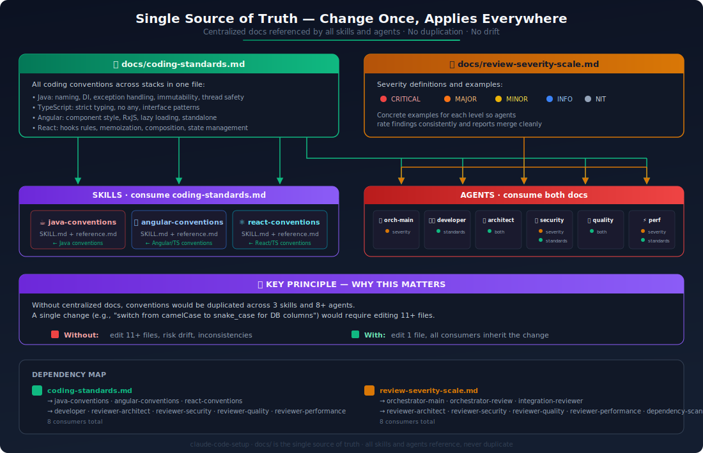

# claude-code-setup

A project-independent, global Claude Code configuration that provides a persistent, personalized AI development environment across all projects. One repo, one install script, works everywhere via symlinks into `~/.claude/`.


## Setup Guide


### Step 1 — Clone this repo somewhere permanent

Pick a location where the repo will stay (it's referenced via symlinks, so don't move it after install).

```bash
# WSL / Linux / macOS
cd ~
git clone https://github.com/YOUR_USER/claude-code-setup.git

# Windows (PowerShell)
cd $env:USERPROFILE
git clone https://github.com/YOUR_USER/claude-code-setup.git
```

### Step 2 — Run the install script

This creates symlinks from the repo into `~/.claude/`. If you already have files in `~/.claude/`, they are backed up automatically before being replaced.

```bash
# WSL / Linux / macOS
cd ~/claude-code-setup
chmod +x install.sh verify.sh
./install.sh

# Windows (PowerShell as Administrator — needed for symlinks)
cd ~\claude-code-setup
.\install.ps1
```

### Step 3 — Verify everything is linked

```bash
./verify.sh        # Unix/WSL
.\verify.ps1       # Windows
```

You should see all green checkmarks. If anything is broken, just re-run the install script.

### Step 4 — (Optional) Edit your private overrides

The install script creates `~/.claude/CLAUDE.local.md` from a template. Open it and add any private settings (API keys, internal paths, company conventions). This file is never committed.

### Step 5 — Use it

That's it. Open any project and start Claude:

```bash
cd ~/projects/my-app
claude
```

Everything loads automatically. No per-project setup needed. Claude now has your coding standards, agents, skills, and commands available in every session.

### For new projects

When you start a fresh project, Claude will ask you kickoff questions (purpose, stack, scale, etc.) and write the answers into the project's `.claude/CLAUDE.md`. This gives all agents project-specific context from day one.

### For existing projects

Run `/document` to generate architecture documentation. Claude analyzes the codebase and writes a project-level `.claude/CLAUDE.md` for future sessions.

---

## What You Get

### Commands

| Command | What It Does |
|---------|-------------|
| `/review` | Full code review — 4 agents in parallel, severity-sorted report saved to `reviews/` |
| `/review src/auth/` | Scoped review of a specific path |
| `/test UserService.java` | Generate unit tests for a file (90%+ coverage target) |
| `/security AuthService.java` | Quick security-focused review |
| `/document` | Generate project architecture documentation |
| `/dependencies` | Scan for vulnerabilities, unused packages, and dependency problems |
| `/upgrade` | Upgrade dependencies and handle breaking changes |
| `/upgrade angular` | Upgrade a specific dependency |

### Agents


### Review Workflow


When you type `/review`, the orchestrator spawns 4 specialized reviewers in parallel. Each focuses on one concern (architecture, security, quality, performance), and the orchestrator merges their findings into a single severity-sorted report saved to `reviews/<timestamp>-review.md`.

### Skills (auto-activate by file type)


### Daily Workflow


---

## Architecture

### Single Source of Truth



Conventions and definitions live in one place to avoid redundancy:

| What | Lives in | Referenced by |
|------|----------|---------------|
| Coding conventions | `docs/coding-standards.md` | Skills, quality reviewer |
| Severity scale | `docs/review-severity-scale.md` | All reviewer agents |
| Framework knowledge | `skills/*/SKILL.md` | Auto-loaded by file type |
| Workflow & philosophy | `global/CLAUDE.md` | Every session |

Change a convention once → everything picks it up.

### Repository Structure

```
claude-code-setup/
│
├── global/
│   └── CLAUDE.md                    → ~/.claude/CLAUDE.md
│                                      Workflow, philosophy, kickoff questions
│
├── agents/                          → ~/.claude/agents/
│   ├── orchestrator-review.md         Coordinates 4 reviewers in parallel
│   ├── reviewer-architect.md          Architecture, SOLID, layering, scalability
│   ├── reviewer-security.md           OWASP, secrets, auth, supply chain, IaC
│   ├── reviewer-quality.md            Code smells, naming, DRY, complexity
│   ├── reviewer-performance.md        N+1, leaks, bundle size, Web Vitals
│   ├── test-writer.md                 Auto-spawns after code completion
│   ├── documenter.md                  Project documentation generator
│   ├── dependency-scanner.md          Dependency vulnerability and health scanner
│   └── upgrader.md                    Dependency version upgrader
│
├── skills/                          → ~/.claude/skills/
│   ├── java-conventions/              Spring lifecycle, JPA, transactions
│   ├── angular-conventions/           Signals, RxJS, change detection
│   └── react-conventions/             Hooks, rendering, Server Components
│
├── commands/                        → ~/.claude/commands/
│   ├── review.md                      /review
│   ├── test.md                        /test
│   ├── security.md                    /security
│   ├── document.md                    /document
│   ├── dependencies.md                /dependencies
│   └── upgrade.md                     /upgrade
│
├── docs/                            → ~/.claude/docs/
│   ├── coding-standards.md            Single source of truth for all conventions
│   └── review-severity-scale.md       Severity definitions for all reviewers
│
├── diagrams/                        Architecture and workflow visualizations
│
└── templates/
    └── CLAUDE.local.md                Template for private overrides
```

### How It Works

The install script creates symlinks from this repo into `~/.claude/`. Claude Code automatically loads everything from `~/.claude/` at session start. Since the symlinks point back to this repo, you can update your configuration by editing files here and the changes apply immediately — no reinstall needed.

### Scope Precedence (highest → lowest)

1. **CLAUDE.local.md** — private overrides, never committed
2. **Project .claude/CLAUDE.md** — project-specific rules (per-repo)
3. **~/.claude/CLAUDE.md** — personal baseline (this repo)

## Private Overrides

`~/.claude/CLAUDE.local.md` is created on first install from `templates/CLAUDE.local.md`. It's gitignored and never committed. Use it for:
- Internal tooling paths
- API keys or environment-specific settings
- Company-specific conventions that shouldn't be public
