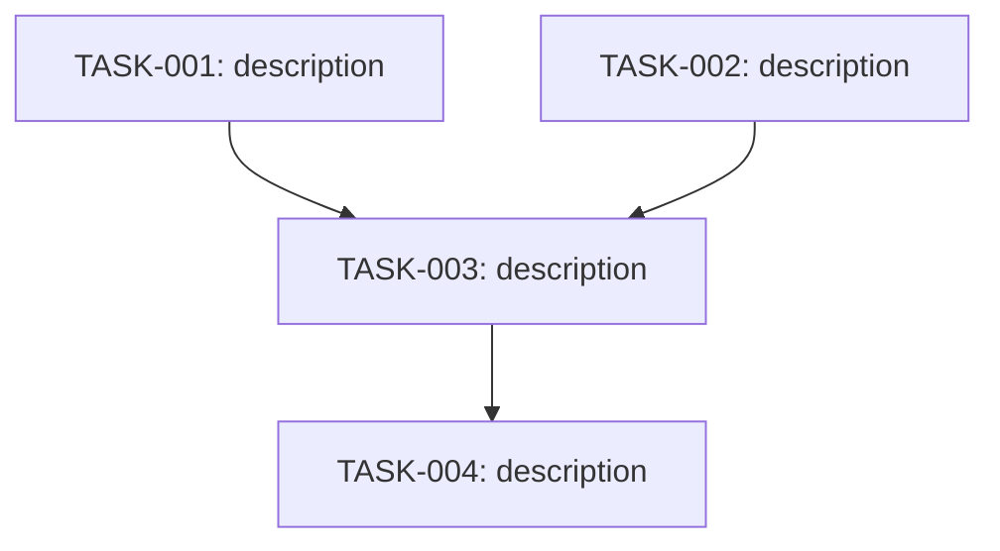

# Task: [Feature Name]

## Branch
`feat/<name>` | `fix/<name>` | `refactor/<name>` | `chore/<name>`

## Summary

[1-2 sentences describing what is being built and why.]

## Open Questions

- [ ] [question] — answered: pending
- [ ] [question] — answered: pending

## Dependency Graph

## Progress

**Phase:** `research` | `architect-review` | `implementation` | `final-review` | `done`
**Active:** [TASK-IDs currently in_progress]
**Completed:** 0 / N tasks

---

## Tasks

- [ ] **TASK-001:** [description]
  - **Depends on:** —
  - **Files:** [files to create or modify]
  - **Context:** [what this task needs to know]
  - **Status:** `pending` | `in_progress` | `done` | `blocked`
  - **Notes:** [filled by orchestrator from developer report]

- [ ] **TASK-002:** [description]
  - **Depends on:** —
  - **Files:** [files to create or modify]
  - **Context:** [what this task needs to know]
  - **Status:** `pending`
  - **Notes:**

- [ ] **TASK-003:** [description]
  - **Depends on:** TASK-001, TASK-002
  - **Files:** [files]
  - **Context:** [what this task needs to know]
  - **Status:** `pending`
  - **Notes:**

- [ ] **TASK-004:** [description]
  - **Depends on:** TASK-003
  - **Files:** [files]
  - **Context:** [what this task needs to know]
  - **Status:** `pending`
  - **Notes:**

---

## Review Notes

Per-task review findings (MINOR/INFO/NIT that were not blocking):

- TASK-001: —
- TASK-002: —

---

## Final Review

- [ ] Integration review passed
- [ ] Full /review passed (security included)
- **Status:** `pending` | `passed` | `failed`

---

## Completion

- [ ] All tasks marked `done`
- [ ] Final review passed
- [ ] Developer notified with merge instructions
